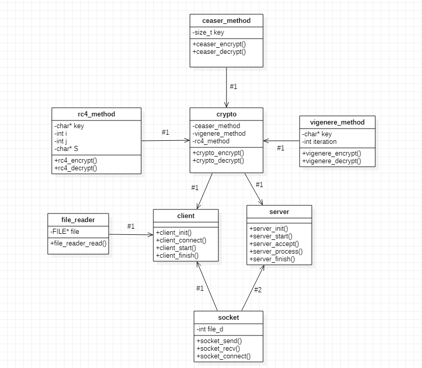
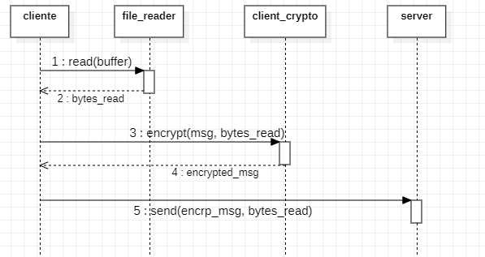
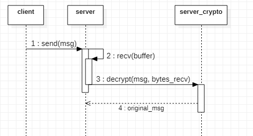

# CryptoSockets - Ejercicio N° 1

- **Francisco Bertolotto - 102671**
- **https://github.com/fbertolotto/7542-TP1**
- **2do Cuatri - 2020**

---

## Enunciado
Se propuso desarrollar dos programas, emisor y receptor, capaces de comunicarse a traves del protocolo TCP - IPV4.
El emisor (cliente) enviara datos cifrados segun los argumentos especificados al momento de ejecutarlo; y el receptor (servidor) estara a cargo de recibirlos, decodificarlos e imprimirlos por salida estándar.

Los métodos disponibles serán:
- **[Cesar](https://es.wikipedia.org/wiki/Cifrado_C%C3%A9sar)**
- **[Vigenere](https://es.wikipedia.org/wiki/Cifrado_de_Vigen%C3%A8re)**
- **[RC4](https://es.wikipedia.org/wiki/RC4)**

## Diseño General

La estructura general del programa se divide en dos grandes módulos. El primero es el **socket**, que se encarga de la comunicación entre ambas partes y el segundo es el **criptógrafo - metodos** que se encarga de el manejo de los distintos métodos y realiza las acciones necesarias para la encriptacion o desencriptacion según sea el caso.

## Problemas Principales

### Distintos Metodos

Para solucionar el problema de los disintos metodos, el criptografo se encarga de tener una referencia a cada tipo existente (en este caso 3), de esta manera el criptografo solo conoce la existencia de lo mismos pero nada mas. Ademas cada método debe poseer: un inicializador, un encriptador, un decriptador y un destructor.

### Criptógrafo

El criptógrafo se crea de forma genérica (sin estar condicionado por su tarea), si bien el servidor no encripta en este ejercicio, el `crypto` que posee tiene las capacidades de encriptar en caso de ser necesario. Lo mismo pero al revés ocurre con el cliente, quien no descifra nada. 
De esta manera, la ampliación de una comunicación `servidor -> cliente` encriptada es posible sin la necesidad de modificar el `crypto` que ya inicializaron.

### Variables que persisten a lo largo de todo el mensaje

Los métodos Vigenere y RC4 poseen ciertas variables que persisten a lo largo de todo el mensaje a descifrar y Cesar utilizada una key numerica y no una cadena. Para solucionar esto, cada TDA sabe perfectamente que valores necesita mantener, entonces es responsabilidad única y exclusiva del método particular mantener y encargarse de estas invariantes a lo largo del mensaje. El criptografo desconoce estas variables, solo pide encriptar y desencriptar al método correspondiente.

### Envio y recepcion de bytes

Se definió que el envio de bytes seria de 64 (para coincidir con lo leído por stdin). Para no dpender del tipo de dato enviado, todo se maneja por los resultados obtenidos por las funciones del sistema. Se encriptan y envían tantos bytes como haya leído el `fread()` y se desencriptan tantos bytes como haya recibido el `recv()`. De esta manera, no solo podemos trabajar con textos sino con archivos binarios.

### Uso de memoria estatica

El conocer el tamaño de todas las estructuras de ante mano permitió realizar el ejercicio sin necesidad de `malloc`. Si bien se podría haber utilizado para guardar la totalidad del mensaje (ya que desconocemos su largo total) en una variable dinámica junto con `realloc`, no fue necesario ya que el crypto nos ofrece la posibilidad ir descifrando de a "chunks".
Esto ademas hubiese traído problemas en casos donde el mensaje hubiera sido extremadamente largo, ya que estaría en su totalidad en memoria.

## Diagramas

Para comprender mejor el programa en general se presentan varios diagramas.

### Flujo de Envio

En este diagrama se aprecia el flujo del envio de datos, notar que este proceso se repite siempre y cuando el `read` del `file_reader` devuelva un valor distinto de `0`. En ese momento termina la ejecución.

### Flujo de Recepcion

Estas operaciones, al igual que antes, se repiten siempre mientras que `recv` obtenga un valor distinto de `0`. Nota: no se encuentra en el diagrama pero luego, se escribe en salida estándar el mensaje original.